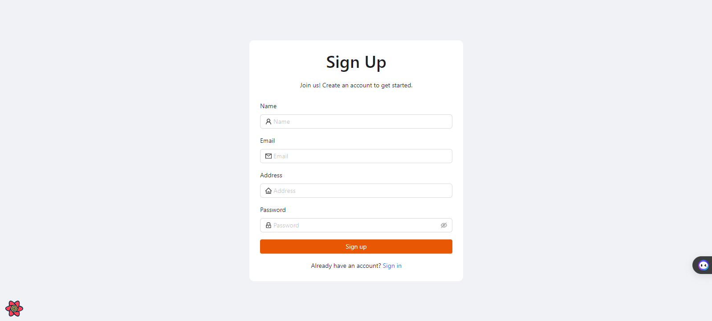
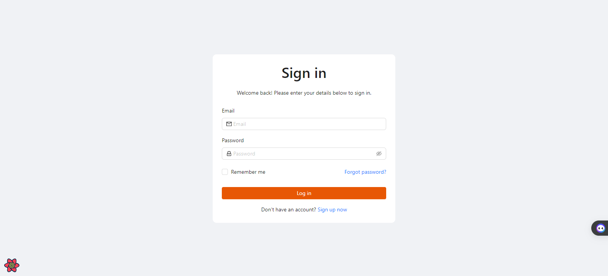
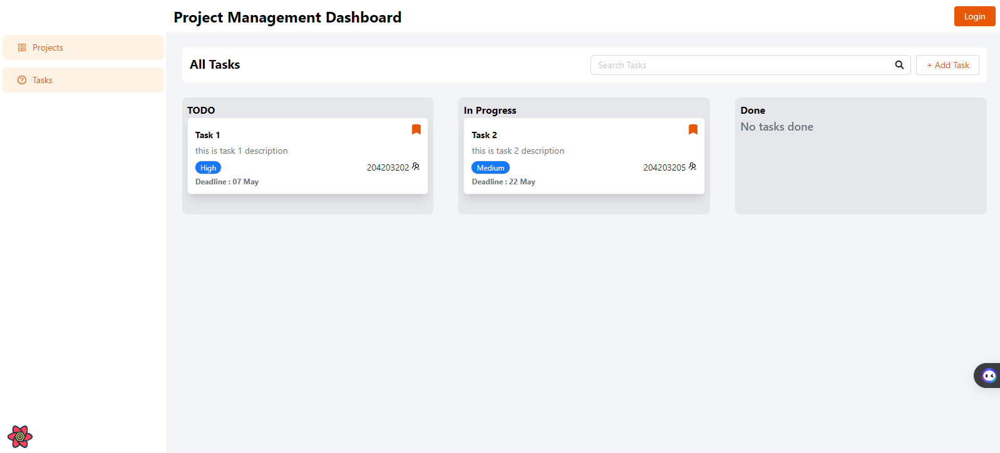

# Project Management Dashboard

## Getting Started

To get started, run the following commands:
clone the repository:

```bash
git clone https://github.com/Masumraihan/project-management-assignment
```

and then run the following command:

```bash
cd project-management-assignment
npm install
npm run dev
```

Open the browser and navigate to http://localhost:3000

## Project Management Dashboard

## Screenshots






## Features

<!-- key features -->

1. Authentication system
2. Implement a custom theme
3. Task management
4. Project management
5. Drag and drop for change task status

## Dependencies

<!-- key dependencies -->

1. React
2. React Hook Form
3. Zod
4. Zustand
5. Next.js
6. Ant Design
7. Axios
8. Moment
9. Sonner
10. UUID
11. Typescript

## Author

Md Masum Raihan
